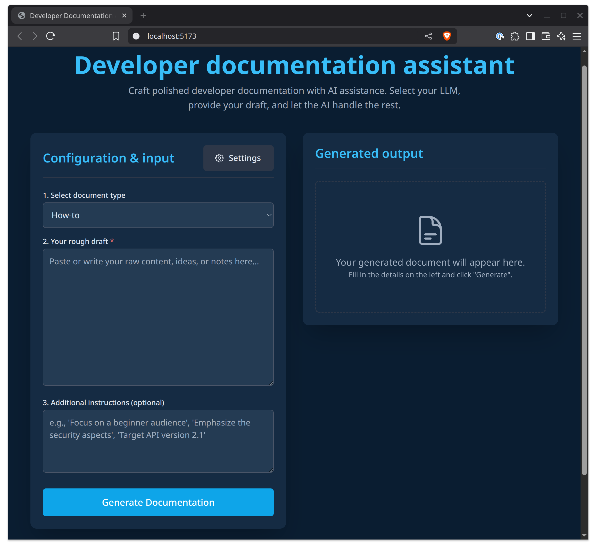

# Developer Documentation Assistant

The Developer Documentation Assistant is a web-based application designed to help create and edit developer documentation. By using large language models (LLMs), this tool streamlines the process of generating consistent, well-structured technical documents.

This project is built with React, TypeScript, and Vite, and integrates with Google Gemini, Azure OpenAI, and standard OpenAI services.



## Functional overview

This application allows users to:

- Select their preferred LLM provider (Google Gemini, Azure OpenAI, or OpenAI).
- Optionally, input their API key and specific endpoint/model configurations for the chosen service via a settings panel.
- Select a predefined document type ("How-to," "Concept").
- Input their rough draft content and any additional instructions.

The system then uses the selected LLM to generate a polished document in Markdown format. This generation is guided by:

- Structural templates specific to the document type.
- Descriptive information about the chosen document type.
- A Markdown styling rules guide (provided as editable text).
- A general writing style guide (provided as editable text).

Users can copy the generated Markdown or download it as a `.md` file.

## Key features

- **LLM-powered generation**: Uses advanced LLMs to transform rough drafts into well-written technical documents.
- **Selectable LLM providers**: Users can choose between Google Gemini, Azure OpenAI, and standard OpenAI.
- **Flexible API configuration**:
    - Optionally allows users to input their own API keys for the selected LLM service via the UI.
    - Supports environment variables for default API keys and endpoints.
    - UI options for Azure OpenAI endpoint, deployment name, and OpenAI model name.
    - Google Search grounding option for Gemini.
- **Customizable content guides**:
    - Predefined document types (e.g., "How-to," "Concept") with initial templates and descriptions.
    - Global Markdown styling rules and a general writing style guide.
    - All templates, descriptions, and guides are initially loaded from `src/constants.ts` but can be viewed and edited live within the application's settings modal for the current session. Users can also load content for these from local files directly into the settings modal.
- **Markdown output**: Generates documents in Markdown format.
- **Export options**: Features "Copy to clipboard" and "Download .md file" options for the generated content.
- **User-friendly interface**: Built with React for a responsive and intuitive user experience, styled with Tailwind CSS.

## Target audience

This tool is aimed at:

- Non-technical writers tasked with creating or editing technical documentation for software developers.
- Anyone needing to write technical documentation, especially those working with defined style guides and document templates, who can benefit from AI assistance to accelerate the process and ensure consistency.

## Core workflow

1. **(Optional) Configure LLM**: Click the "Settings" button to:
    - Select your preferred LLM provider (Google Gemini, Azure OpenAI, OpenAI).
    - Enter your API key for the service. If not entered, the application will attempt to use corresponding environment variables.
    - For Azure OpenAI, specify the endpoint and deployment name.
    - For OpenAI, specify the model name (optional, defaults to a pre-configured model).
    - For Gemini, toggle Google Search grounding if desired.
2. **(Optional) Customize guides**: In the "Settings" modal, under "Guides & templates":
    - Review and edit the global Markdown styling rules or general writing style guide.
    - Select a document type to view/edit its specific template and description.
    - Load content for any guide/template from local `.md` or `.txt` files.
3. **Select document type**: Choose the type of document you intend to create from the main page dropdown.
4. **Input rough draft**: Paste or write your initial content into the "Your rough draft" text area.
5. **(Optional) Add instructions**: Provide any additional context or specific points for the LLM to consider in the "Additional instructions" area.
6. **Generate document**: Click the "Generate documentation" button.
7. **Review output**: The LLM-generated Markdown will appear in the output panel.
8. **Use document**: Copy the content to your clipboard or download it as a `.md` file.

## Technology stack

- **Frontend**: React 19, TypeScript, Vite
- **Styling**: Tailwind CSS
- **LLM SDKs / Libraries**:
   - `@google/genai` for Google Gemini
   - `@azure/openai` for Azure OpenAI services
   - `openai` for standard OpenAI services

## Getting started: Running locally

### Prerequisites

- Node.js (version 18.x or later recommended)
- npm (comes with Node.js)

### Installation

1. Clone this repository or download and extract the archive.
2. Enter the project root directory.
3. Install dependencies:

    ```bash
    npm install
    ```

### Environment variables (.env.local)

For the application to connect to LLM services using default credentials (credentials not entered in the app's settings by using its UI), you need to set up environment variables.

Create a file named `.env.local` in the root of the project and add the necessary API keys and configurations. The application will prioritize keys and configurations entered in the UI settings, but will fall back to these environment variables if UI fields are left blank.

```ini
# For Google Gemini
GEMINI_API_KEY=your_gemini_api_key_here

# For Azure OpenAI
AZURE_OPENAI_API_KEY=your_azure_openai_api_key_here
AZURE_OPENAI_ENDPOINT=your_azure_openai_endpoint_here # Example: https://your-resource-name.openai.azure.com/
AZURE_OPENAI_DEPLOYMENT_NAME=your_azure_openai_deployment_name_here # Example: gpt-4o-mini

# For standard OpenAI
OPENAI_API_KEY=your_openai_api_key_here
OPENAI_MODEL_NAME=gpt-4o-mini # Optional: Overrides the default model if specified
```

**Note**:

- NEVER commity the `.env.local` file source control.
- If you provide an API key in the UI's settings, that key will override the corresponding environment variable for that session.

### Running the development server

Once dependencies are installed and your `.env.local` file is configured (optional - you can also enter keys in the UI), run:

```bash
npm run dev
```

This will start the Vite development server, typically on `http://localhost:5173`.

### Building for production

To create a production build:

```bash
npm run build
```

The output will be in the `dist` folder. You can preview the production build locally using:

```bash
npm run preview
```

## Configuration of content

- **Document types**: Defined in `src/constants.ts` (array `DOCUMENT_TYPES`). Each object specifies an ID, name, and conceptual paths (which map to keys in `DOCUMENT_TEMPLATES` and `DOCUMENT_DESCRIPTIONS`).
- **Initial content for guides and templates**:
   - Markdown styling rules: `MARKDOWN_STYLE_GUIDE_CONTENT` in `src/constants.ts`.
   - General writing style guide: `GENERAL_WRITING_STYLE_GUIDE_CONTENT` in `src/constants.ts`.
   - Document-specific templates: `DOCUMENT_TEMPLATES` object in `src/constants.ts`.
   - Document-specific descriptions: `DOCUMENT_DESCRIPTIONS` object in `src/constants.ts`.
- **Live customization**: All these content pieces can be viewed and edited for the current session via the "Settings" modal in the application. Changes made in the UI do not persist back to the `constants.ts` file but are used for generation during that session.

## Project structure

- `public/`: Static assets.
   - `templates/`: Contains example Markdown files for document type templates (Note: actual initial content is in `src/constants.ts`).
   - `descriptions/`: Contains example Markdown files for document type descriptions (Note: actual initial content is in `src/constants.ts`).
- `src/`: Source code.
   - `components/`: React components used to build the UI.
   - `constants.ts`: Core application constants, including initial document types, style guides, templates, and model names.
   - `services/`: Logic for interacting with LLMs (`geminiService.ts`, `azureOpenaiService.ts`, `openaiService.ts`, `llmService.ts`) and retrieving content (`contentService.ts`).
   - `types.ts`: TypeScript type definitions.
   - `App.tsx`: Main application component.
   - `index.tsx`: Entry point for the React application.
- `.env.local`: For local environment variable configuration (you need to create this file).
- `vite.config.ts`: Vite build configuration.
- `package.json`: Project dependencies and scripts.
- `tsconfig.json`: TypeScript configuration.

## License

This project is licensed under the [CC0 1.0 Universal](https://creativecommons.org/publicdomain/zero/1.0/) license.
